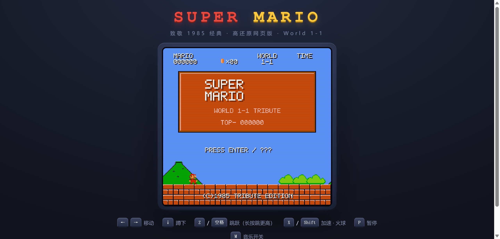

# Super Mario · Makey Makey Edition (Web Remake)

A web remake of the 1985 classic *Super Mario* World 1-1, built purely with Canvas.
**Every pixel sprite and sound effect is drawn / synthesized in code** — there are no
image or audio asset files.



## Controls

Plays with a **Makey Makey** or a regular keyboard — the controls are identical,
because a Makey Makey emits the same Arrow keys, Space, and mouse Click.

- **← →** Move · **↓** Crouch
- **↑** Jump (hold to jump higher)
- **Space** Run · Fireball
- **Click** (Makey Makey CLICK pad / left mouse button) Jump · Start
- **P** Pause · **M** Music on/off
- Touch devices automatically show an on-screen gamepad

Eat a mushroom to grow big and smash bricks from below, grab a fire flower to throw
fireballs, bump a stomped turtle's shell to kick it, and a 1UP hides inside a secret brick.

### Makey Makey wiring

The six front pads map directly to the game:

| Makey Makey pad | Action |
|------|------|
| ← / → | Move |
| ↓ | Crouch |
| ↑ | Jump |
| Space | Run / Fireball |
| Click | Jump (alternate) / Start |

## Tech

| File | Role |
|------|------|
| `js/font.js` | Procedural bitmap font (HUD text) |
| `js/sprites.js` | All pixel sprites drawn in code (Mario / enemies / items / terrain tiles) |
| `js/audio.js` | BGM and sound effects synthesized with the Web Audio API |
| `js/level.js` | World 1-1 level data |
| `js/game.js` | Main loop, physics, collision, state machine, input |
| `style.css` | Cabinet, screen bezel, scanlines, gamepad styling |

## Running locally

Must be served over HTTP (do not use `file://`):

```bash
npx serve        # or  python -m http.server 8080
```

Then open `http://localhost:8080/` and press Up / Space (or click the screen) to start.
Sound is enabled only after your first interaction, due to browser autoplay policy.

## Notes

- All third-party tracking scripts (`reporter-pb`, `addon`) and the `<base href>` from
  the original page have been removed; the page loads only local resources.
- `reference/original.html` is the originally captured landing page, kept only as a baseline reference.
- FAN TRIBUTE · For learning and fun only.
